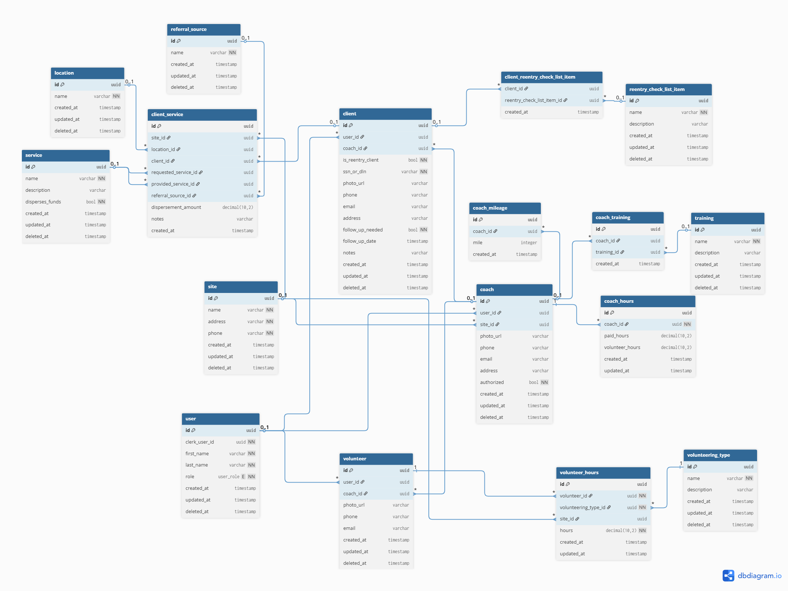

// Use DBML to define your database structure
// https://dbdiagram.io

// Use DBML to define your database structure
// https://dbdiagram.io

Table site {
id uuid [primary key]
name varchar [not null]
address varchar [not null]
phone varchar [not null]
created_at timestamp
updated_at timestamp
deleted_at timestamp
Indexes { (deleted_at) }
}

Table location {
id uuid [primary key]
name varchar [not null]  
 created_at timestamp
updated_at timestamp
deleted_at timestamp
Indexes { (deleted_at) }
}

Enum user_role {
admin
coach
client
volunteer
client_volunteer
}

Table user {
id uuid [primary key]
clerk_user_id uuid [not null, unique]
first_name varchar [not null]
last_name varchar [not null]
role user_role [not null, default: "client"]
created_at timestamp
updated_at timestamp
deleted_at timestamp
Indexes {
(role)
(deleted_at)
}
}

Table coach {
id uuid [primary key]
user_id uuid [ref: > user.id]
site_id uuid [ref: > site.id]
photo_url varchar
phone varchar
email varchar
address varchar
authorized bool [not null, default: false]
created_at timestamp
updated_at timestamp
deleted_at timestamp
Indexes {
(user_id)
(site_id)
(deleted_at)
}
}

Table coach_mileage {
id uuid [primary key]
coach_id uuid [ref: > coach.id]
mile integer
created_at timestamp
}

Table client {  
 id uuid [primary key]  
 user_id uuid [ref: > user.id]
coach_id uuid [ref: > coach.id]
is_reentry_client bool [not null, default: false]
ssn_or_dln varchar [not null, default: "0"]
photo_url varchar
phone varchar  
 email varchar
address varchar
follow_up_needed bool [not null, default: false]
follow_up_date timestamp
notes varchar
created_at timestamp
updated_at timestamp
deleted_at timestamp
Indexes {
(user_id)
(coach_id)
(deleted_at)
}
}

Table service {
id uuid [primary key]
name varchar [not null]  
 description varchar
disperses_funds bool [not null, default: false]
created_at timestamp
updated_at timestamp
deleted_at timestamp
Indexes { (deleted_at) }
}

Table training {
id uuid [primary key]
name varchar [not null]
description varchar
created_at timestamp
updated_at timestamp
deleted_at timestamp
Indexes { (deleted_at) }
}

Table reentry_check_list_item {
id uuid [primary key]
name varchar [not null]
description varchar
created_at timestamp
updated_at timestamp
deleted_at timestamp
Indexes { (deleted_at) }
}

Table volunteer {
id uuid [primary key]
user_id uuid [ref: > user.id]
coach_id uuid [ref: > coach.id]
photo_url varchar
phone varchar
email varchar
created_at timestamp
updated_at timestamp
deleted_at timestamp
Indexes {
(user_id)
(coach_id)
(deleted_at)
}
}

Table volunteering_type {
id uuid [primary key]
name varchar [not null]
description varchar
created_at timestamp
updated_at timestamp
deleted_at timestamp
Indexes { (deleted_at) }
}

Table coach_hours {
id uuid [primary key]
coach_id uuid [ref: > coach.id, not null]
paid_hours decimal(10, 2)
volunteer_hours decimal(10, 2)
created_at timestamp
updated_at timestamp
Indexes {(coach_id)}
}

Table volunteer_hours {
id uuid [primary key]
volunteer_id uuid [ref: > volunteer.id, not null]
volunteering_type_id uuid [ref: > volunteering_type.id, not null]
site_id uuid [ref: > site.id]
hours decimal(10, 2) [not null]
created_at timestamp
updated_at timestamp
Indexes {
(volunteer_id)
(volunteering_type_id)
(site_id)
}
}

Table referral_source {
id uuid [primary key]
name varchar [not null]
created_at timestamp
updated_at timestamp
deleted_at timestamp
Indexes { (deleted_at) }
}

Table client_service {
id uuid [primary key]
site_id uuid [ref: > site.id]
location_id uuid [ref: > location.id]
client_id uuid [ref: > client.id]
requested_service_id uuid [ref: > service.id]
provided_service_id uuid [ref: > service.id]
referral_source_id uuid [ref: > referral_source.id]
dispersement_amount decimal(10, 2)
notes varchar
created_at timestamp
Indexes {
(client_id)
(site_id)
(location_id)
(requested_service_id)
(provided_service_id)
(referral_source_id)  
 }
}

Table client_reentry_check_list_item {
client_id uuid [ref: > client.id]
reentry_check_list_item_id uuid [ref: > reentry_check_list_item.id]
created_at timestamp
Indexes {(client_id, reentry_check_list_item_id) [unique] }
}

Table coach_training {
id uuid [primary key]
coach_id uuid [ref: > coach.id]
training_id uuid [ref: > training.id]
created_at timestamp
Indexes { (coach_id, training_id) [unique] }
}

